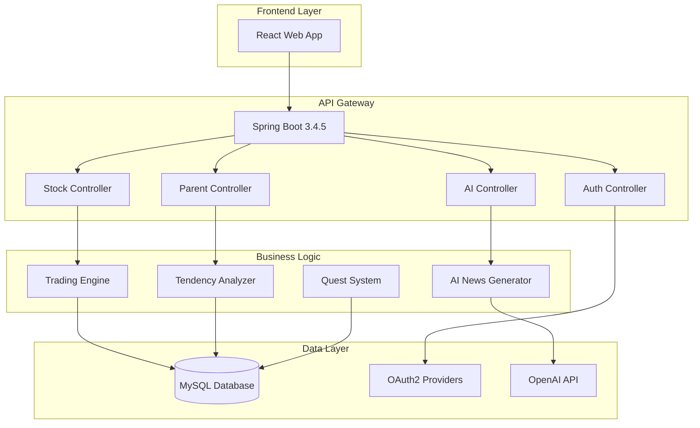

# 💰 Money Kids Back
**AI-Powered Youth Economic Education Platform with Real-time Stock Simulation**

<div align="center">


**🏆 혁신적인 청소년 경제교육 플랫폼**  
*AI 기반 뉴스 생성 → 실시간 주가 변동 → 개인화된 투자 성향 분석*

[🚀 Demo](#demo) • [📖 API Docs](#api-documentation) • [🏗️ Architecture](#architecture) • [⚡ Quick Start](#quick-start)

</div>

---

## 🎯 **프로젝트 비전**

> **"AI와 함께하는 차세대 금융 교육 혁명"**  
> 청소년들이 **가상 투자 환경**에서 **실제와 같은 경제 체험**을 통해  
> **올바른 경제 관념**과 **투자 철학**을 자연스럽게 학습할 수 있는 **혁신적 플랫폼**

### 💡 핵심 혁신 기술
- 🤖 **AI 뉴스 자동 생성**: OpenAI API로 4시간마다 경제 뉴스 생성
- 📈 **뉴스 연동 주가 시스템**: AI 뉴스 감정 분석으로 실시간 주가 변동
- 🧠 **LLM 성향 분석**: 사용자 행동 기반 개인화된 투자 성향 분석
- 👨‍👩‍👧‍👦 **학부모 대시보드**: 자녀의 경제교육 현황 실시간 모니터링

---

## 🏗️ **시스템 아키텍처**

<div align="center">



</div>

---

## ⚡ **핵심 기능 Overview**

### 🔐 **인증 & 보안**
- **OAuth2 소셜 로그인** (Google, Kakao)
- **환경변수 기반 보안** (.env 파일 관리)
- **Spring Security** 통합 인증

### 🤖 **AI 뉴스 & 주가 시스템**
```java
🎯 AI 뉴스 생성 → 감정 분석 → 주가 변동 (4~8단계)
📊 실시간 주가 업데이트 → 포트폴리오 자동 계산
📈 CompletableFuture 비동기 처리로 성능 최적화
```

### 💰 **투자 시뮬레이션**
- **실시간 주식 거래** (매수/매도)
- **포트폴리오 관리** (수익률, 손익 계산)
- **위시리스트 기능** (관심 종목 추적)
- **카테고리별 주식 분류** (IT, 음식료, 엔터테인먼트 등)

### 🧠 **개인화 학습 시스템**
- **LLM 성향 분석** (5가지 투자 성향)
- **적응형 퀴즈 시스템** (난이도별)
- **일일 퀘스트** (자동 생성)
- **성과 추적** (레벨업 시스템)

### 👨‍👩‍👧‍👦 **학부모 모니터링**
- **자녀 대시보드** (학습 현황 종합)
- **성향 변화 추이** (시간별 분석)
- **맞춤형 교육 추천** (AI 기반)
- **활동 로그 분석** (패턴 인사이트)

---

## 📡 **API Documentation**

### 🏛️ **Core APIs**

<details>
<summary><b>🔐 Authentication APIs</b></summary>

| Method | Endpoint | Description |
|--------|----------|-------------|
| `POST` | `/api/auth/login` | 일반 로그인 |
| `GET` | `/api/auth/oauth2/google` | Google OAuth2 로그인 |
| `GET` | `/api/auth/oauth2/kakao` | Kakao OAuth2 로그인 |
| `POST` | `/api/auth/logout` | 로그아웃 |

</details>

<details>
<summary><b>📈 Stock & Trading APIs</b></summary>

| Method | Endpoint | Description |
|--------|----------|-------------|
| `GET` | `/api/stocks` | 전체 주식 목록 조회 |
| `GET` | `/api/stocks/category/{category}` | 카테고리별 주식 조회 |
| `POST` | `/api/trade/buy` | 주식 매수 |
| `POST` | `/api/trade/sell` | 주식 매도 |
| `GET` | `/api/portfolio/{userId}` | 포트폴리오 조회 |
| `GET` | `/api/portfolio/{userId}/profit-loss` | 수익률 분석 |

</details>

<details>
<summary><b>🤖 AI & Analysis APIs</b></summary>

| Method | Endpoint | Description |
|--------|----------|-------------|
| `POST` | `/api/ai/generate-news` | AI 뉴스 생성 |
| `POST` | `/api/ai/analyze-tendency` | 투자 성향 분석 |
| `GET` | `/api/articles/latest` | 최신 AI 뉴스 조회 |
| `GET` | `/api/analysis/{userId}/result` | 성향 분석 결과 |

</details>

<details>
<summary><b>🎓 Learning & Quest APIs</b></summary>

| Method | Endpoint | Description |
|--------|----------|-------------|
| `GET` | `/api/quizzes/random` | 랜덤 퀴즈 조회 |
| `POST` | `/api/quizzes/submit` | 퀴즈 정답 제출 |
| `GET` | `/api/quests/daily` | 일일 퀘스트 조회 |
| `POST` | `/api/quests/{questId}/complete` | 퀘스트 완료 |
| `GET` | `/api/worksheets/category/{category}` | 학습 자료 조회 |

</details>

<details>
<summary><b>👨‍👩‍👧‍👦 Parent Dashboard APIs</b></summary>

| Method | Endpoint | Description |
|--------|----------|-------------|
| `GET` | `/api/parent/child/{childId}/dashboard` | **통합 대시보드** ⭐ |
| `GET` | `/api/parent/child/{childId}/tendency-graph` | 성향 그래프 데이터 |
| `GET` | `/api/parent/child/{childId}/learning-progress` | 학습 성과 분석 |
| `GET` | `/api/parent/child/{childId}/investment-analysis` | 투자 포트폴리오 분석 |
| `GET` | `/api/parent/child/{childId}/recommendations` | 맞춤형 교육 추천 |

</details>

---

## 🛠️ **기술 스택**

### **Backend**
- **Spring Boot 3.4.5** - Enterprise Java Framework
- **Spring Security** - Authentication & Authorization  
- **Spring Data JPA** - ORM & Database Management
- **MySQL 8.0** - Primary Database
- **Gradle** - Build & Dependency Management

### **AI & External APIs**
- **OpenAI GPT-4** - AI News Generation & Analysis
- **OAuth2** - Social Login (Google, Kakao)
- **CompletableFuture** - Asynchronous Processing

### **Database Schema**
```sql
📊 17개 테이블 | 완전한 관계형 설계
👥 users, 📈 stocks, 💰 user_stocks, 📰 articles
🧪 quizzes, 📝 user_quiz, 🎯 daily_quest, 📊 tendency_analysis
📋 worksheets, 📜 activity_logs 등
```

---

## ⚡ **Quick Start**

### **1. 환경 설정**
```bash
# Repository Clone
git clone https://github.com/your-repo/money-kids-back.git
cd money-kids-back

# 환경변수 설정
cp .env.example .env
# .env 파일에 API 키 및 DB 정보 입력
```

### **2. 데이터베이스 초기화**
```bash
# MySQL 서버 실행 후
mysql -u root -p < database_setup.sql
# 또는 테스트 데이터 포함
mysql -u root -p < database_with_data.sql
```

### **3. 애플리케이션 실행**
```bash
# 개발 모드 실행
./gradlew bootRun

# 프로덕션 빌드
./gradlew build
java -jar build/libs/money-kids-back-0.0.1-SNAPSHOT.jar
```

### **4. API 테스트**
```bash
# 헬스체크
curl http://localhost:8080/actuator/health

# 주식 목록 조회
curl http://localhost:8080/api/stocks

# 대시보드 테스트 (학부모용)
curl http://localhost:8080/api/parent/child/{userId}/dashboard
```

---

## 📊 **주요 데이터**

### **📈 주식 종목 (9개)**
- **IT**: 삼성전자, 넥슨게임즈
- **음식료**: 맥도날드, 스타벅스, 배스킨라빈스, 오리온, 농심
- **완구**: 레고코리아
- **엔터테인먼트**: 포켓몬카드

### **🧪 학습 컨텐츠**
- **퀴즈**: 114개 (기초/중급/고급)
- **워크시트**: 15개 (카테고리별)
- **AI 뉴스**: 자동 생성 시스템

### **🎯 게임화 요소**
- **포인트 시스템**: 학습/투자 활동별 포인트 지급
- **레벨업**: 1000포인트당 레벨 상승
- **일일 퀘스트**: 자동 생성되는 학습 목표

---

## 🌟 **혁신적 특징**

### **🤖 AI-Driven Market Simulation**
```
실제 경제와 유사한 주가 변동을 AI가 생성하는 뉴스를 통해 구현
→ 단순한 랜덤이 아닌 논리적 근거가 있는 시장 시뮬레이션
```

### **🧠 Personalized Learning Path**
```
사용자의 투자 행동 패턴을 LLM이 분석
→ 개인 맞춤형 경제 교육 커리큘럼 자동 생성
```

### **👨‍👩‍👧‍👦 Parent-Child Educational Bridge**
```
학부모가 자녀의 경제 학습 현황을 실시간으로 모니터링
→ 가정 내 경제 교육 연계 강화
```

---

## 📚 **추가 문서**

- **[📖 학부모 API 가이드](PARENT_API_GUIDE.md)** - 학부모 대시보드 완전 가이드
- **[🗄️ 데이터베이스 설정](DATABASE_SETUP_README.md)** - DB 초기화 및 관리 가이드
- **[🔧 개발 환경 설정](.env.example)** - 환경변수 템플릿

---

## 🏆 **프로젝트 완성도**

### **✅ 완전 구현된 기능 (95%)**
- ✅ OAuth2 소셜 로그인
- ✅ AI 뉴스 생성 및 주가 연동
- ✅ 실시간 투자 시뮬레이션  
- ✅ LLM 기반 성향 분석
- ✅ 게임화된 학습 시스템
- ✅ 학부모 모니터링 대시보드
- ✅ 포괄적인 활동 로깅

### **⚡ 기술적 우수성**
- **비동기 처리**: CompletableFuture로 성능 최적화
- **확장 가능한 아키텍처**: 모듈화된 서비스 설계
- **보안**: 환경변수 기반 민감정보 관리
- **데이터 무결성**: 17개 테이블 완전한 관계형 설계

---

<div align="center">

## 🚀 **혁신적인 청소년 금융교육의 새로운 패러다임**

**Money Kids Back**은 단순한 교육 앱을 넘어서  
AI와 실시간 시뮬레이션이 결합된 **차세대 핀테크 교육 플랫폼**입니다.

*미래의 경제 주역들이 올바른 금융 가치관을 형성할 수 있도록 돕는  
혁신적이고 지속 가능한 교육 생태계를 제공합니다.*

---

**Made with ❤️ for the future economists**

</div> 